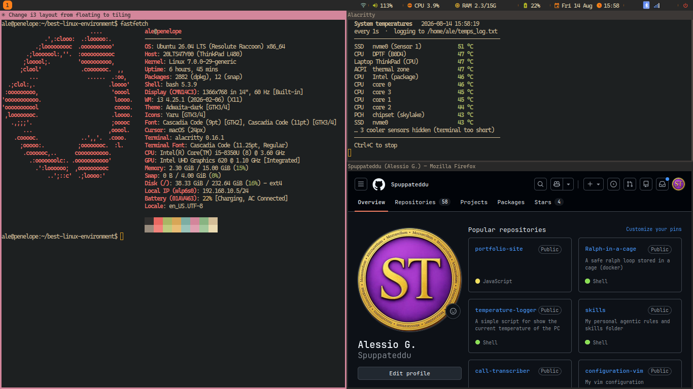

# .i3rc

My i3 window manager setup: Gruvbox Dark palette, eww top bar (per-monitor
workspaces, volume, calendar popup, system tray), rofi launcher, solid
Gruvbox-dark background, picom compositing, dunst notifications, and
mpd + ncmpcpp for offline music.

**Windows float by default** — i3 runs here as a normal desktop, not a tiling
WM. `$mod+Control+space` switches the whole desktop to plain tiling and back.
See [Floating desktop](#floating-desktop) below.

Floating, the default — windows overlap, each with its own title bar:


Tiling, one `$mod+Control+space` away — every window takes a share of the screen:



- **Install on a new machine:** run `./setup.sh` (idempotent — also builds eww from source; the font — Cascadia Code NF, the only one this repo names — and the cursor theme come from *best-linux-environment*). Full breakdown in [INSTALL.md](./INSTALL.md).
- **Main i3 config:** [config](./config)
- **Top bar:** [eww/](./eww/) — `eww.yuck` (layout/widgets), `eww.scss` (style), `scripts/` (data sources)
- **Launcher themes:** [rofi/](./rofi/)
- **Compositor:** [picom/picom.conf](./picom/picom.conf)
- **Notifications:** [dunst/dunstrc](./dunst/dunstrc)
- **Music daemon:** [mpd/mpd.conf](./mpd/mpd.conf) + [ncmpcpp/config](./ncmpcpp/config) — started on demand by `mpd.socket`, never at login
- **Scripts:** [scripts/](./scripts/) — bar launcher, power menu, media transport

> Bluetooth is the blueman tray icon in the bar's systray.
> [`scripts/bluetooth_menu.sh`](./scripts/bluetooth_menu.sh) is a rofi
> alternative to it, kept but **not bound to anything** — add a `bindsym` in
> `config.local` if you want it.

## On its own, or as part of best-linux-environment

Both work, and this repo is written not to care which one ran it.

**On its own** — clone it **to `~/.i3rc`** and run [`setup.sh`](./setup.sh).
The path is not a convention here: i3's config format has no way to refer to its
own directory, so the 17 `exec` lines in [config](./config) name `~/.i3rc`
literally, and `setup.sh` refuses to run from anywhere else rather than
half-working at runtime. Two things are deliberately *not* in this repo because
they are shared with the terminal and the editor — the **font** (Cascadia Code NF)
and the **cursor theme**; install those by hand from
[INSTALL.md §3](./INSTALL.md) when you go standalone.

**As part of a whole machine** —
[**best-linux-environment**](https://github.com/Spuppateddu/best-linux-environment)
sets up an entire Ubuntu box, and this is one of the config repos it manages.
Its `./setup.sh` clones this one into `~/linux-configuration/i3`, leaves
`~/.i3rc` behind as a symlink to it — which is what satisfies the path check
above — and then calls [`install.sh`](./install.sh), the thin wrapper that runs
`setup.sh` and live-reloads i3 and the eww bar afterwards. It also owns the
font and the cursor theme, and installs the programs the keybinds assume
(alacritty, firefox, flameshot), so there is nothing left to do by hand.

## Floating desktop

Every window opens **floating**, with a real draggable title bar, as a tall
rectangle: 45% of the screen wide × 95% of its height. Two stand side by side,
and the window uses nearly the whole height of the screen. Click-to-focus, not
focus-follows-mouse.

A new window lands on a **random free spot that keeps the window you came from
in sight**. `float.sh` lays 9 × 5 candidate spots across the usable workspace,
measures at each one how much of the previously focused window the new frame
would hide, and draws at random among all the spots that hide **at most a
quarter** of it — so you always keep three quarters of the old window and all of
the new one, and no two windows opened in a row land in the same place. It is
not just left or right: dead centre, a little up and to the right, low on the
left, all of them come up, whichever ones happen to leave the old window
readable.

The rest is tie-breaking you rarely notice:

- **Nothing else open** — dead centre, every time.
- **Spots that also leave the other windows alone** win the draw whenever there
  are any, so free screen is used before something gets buried.
- **A full screen**, where every spot hides more than a quarter, draws among the
  least-hiding spots instead of giving up and stacking.
- **No window opens flush against an edge** — every spot keeps 16px from the
  borders of the usable workspace, the bar included.

`$mod+Shift+h/j/k/l` is **layout-aware** — i3 cannot be, so
[`scripts/float.sh`](./scripts/float.sh) decides per keypress:

| | floating window | tiled window |
|---|---|---|
| `$mod+Shift+h` / `l` | snap to the left / right half | move it left / right |
| `$mod+Shift+k` | grow to the whole screen below the bar — still a floating window, not fullscreen | move it up |
| `$mod+Shift+j` | back to the standard size, centred | move it down |

The arrow keys (`$mod+Shift+←↓↑→`) never snap: on a floating window they nudge
it a few pixels. `$mod+Shift+space` tiles the focused window, and `Super+Down`
stashes it in the scratchpad — the closest thing i3 has to a minimise.

`$mod+r` is layout-aware the same way, through
[`scripts/window_mode.sh`](./scripts/window_mode.sh): a tiled window gets i3's
own resize mode, a floating one gets a mode that sizes **one edge at a time**
and moves the window with the arrow keys.

| | floating window |
|---|---|
| `h/j/k/l` | push that edge outward |
| `H/J/K/L` | pull the same edge back in |
| `←↓↑→` | move the window, size unchanged |
| `Return` / `Escape` / `$mod+r` | leave the mode |

Sizing never touches the opposite edge, so you size a window against whichever
corner you want it in. Growing stops dead at the usable workspace and a move
stops flush against it, so a floating window can never end up off the monitor;
shrinking always works, down to 120×80. That makes the whole window keyboard-
only: size it with `hjkl`, then place it with the arrows. The focused window
wears a thick frame while the mode is on. i3 cannot clamp a resize or a move
itself, hence a script behind each keypress.

Every window wears a 3px border; the focused one wears 4px, redrawn by
[`scripts/focus_border.sh`](./scripts/focus_border.sh) on every `window::focus`
event, because i3 can only vary a border's *colour* with focus, not its width.
It touches those two widths alone, so a per-app `pixel 1` and the 6px `$mod+r`
cue are never disturbed.

Nothing is hardcoded to one screen. Every number comes from the live workspace
rect, which i3 has already shrunk by the eww bar's strut, so the same commit is
exact on a 3440×1440 ultrawide and a 1366 ThinkPad panel. `float.sh watch` runs
as an `exec_always` daemon and places each new window from the `window::new`
event.

Placement is that daemon's alone — the `for_window` rule in `config` floats a
new window and gives it a border, and deliberately does **not** centre it. Any
`i3-msg reload` re-arms every `for_window` rule (i3 forgets it already ran them
for the open windows), so each rule fires again on that window's next title
change: a `move position center` there would fling windows you had placed by
hand back to the middle, minutes after the reload.

Eight knobs, all optional, exported before i3 starts:

```bash
I3RC_STD_W_PCT=45     # standard window width, % of the usable workspace
I3RC_STD_H_PCT=95     # ...and its height
I3RC_VMAX_W_PCT=100   # width $mod+Shift+k grows a window to, % of the same
I3RC_VMAX_H_PCT=100   # ...and its height
I3RC_PLACE_COLS=9     # candidate spots across the screen; 1 = always centred
I3RC_PLACE_ROWS=5     # ...and down it; 1 x 1 turns the draw off
I3RC_MAX_COVER_PCT=25 # how much of the window you came from a new one may hide
I3RC_EDGE_GAP_PX=16   # room a new window keeps from the screen edges; 0 = flush
```

### Tiling mode

`$mod+Control+space` switches the **whole desktop** — floating desktop ↔ plain
tiling i3, open windows included, either way.
[`scripts/desktop_mode.sh`](./scripts/desktop_mode.sh) does it with config
rules, not a daemon: tiling mode is a generated `90-tiling-mode.local`, which
the `include ~/.i3rc/*.local` line at the end of [config](./config) picks up, so
its `floating disable` runs right after the catch-all that floats everything.
Both fire while i3 is still managing the window, so nothing is ever drawn
floating and then yanked into the layout.

The file **is** the stored mode: present = tiling, gone = floating, and it
survives a reboot. Three rules undo the tiling one for windows that must keep
floating — anything in the scratchpad (tiling one there hides it for good),
flameshot, and Firefox's Picture-in-Picture. The switch reloads i3, so the bar
blinks once, and it re-places every open window: `$mod+Shift+space` still flips
a single window inside either mode.

Tiled windows get their own frame width for the left, right and bottom sides:
`I3RC_TILE_BORDER_PX`, exported before i3 starts like the knobs above, default
3. That is the same as `config`'s floating 3px, so out of the box the switch
leaves the width alone; 2 makes it thinner, and the seam between two tiles a
4px target. That rule is a second generated file, `00-tiling-border.local`,
named to sort *before* the per-app border files, so an image viewer's
`border pixel 1` still wins there exactly as it does over `config`. The switch
also swaps the border on the open windows — only those still wearing the
catch-all's, so a per-app border is never touched; a window flipped alone with
`$mod+Shift+space` keeps whatever it has.

The title bar stays on a tiled window unless `00-no-titlebar.local` is there.
That file is written by *best-linux-environment* (`BLE_I3_TITLEBAR=false` in its
`settings.local`) and its **presence is the flag**, the same way
`90-tiling-mode.local`'s is the mode: `desktop_mode.sh` reads it, and writes
`border pixel 3` instead of `border normal 3` — same frame width, no bar. So the
two settings are independent, and neither file has to know the other's number.
Without that file nothing changes; this repo on its own keeps its title bars.

Tiled, only the focused window is coloured. The same `90-tiling-mode.local`
puts `client.unfocused` and `client.focused_inactive` back to `config`'s greys,
over the `06-colors.local` that best-linux-environment writes to colour every
unfocused window: it sorts later, and i3 takes the last `client.*` line. Going
back to floating deletes the file, so the rolled unfocused colour returns.

`$mod+Shift+h/j/k/l` and `$mod+r` keep working in tiling mode — with nothing
floating, `float.sh` and `window_mode.sh` always take their `move`/i3-resize
branch.

## Machine-specific settings

Anything that should apply to **only one computer** (and never be committed or
shared with people who clone this repo) goes in:

```
~/.i3rc/config.local
```

The main [config](./config) ends with `include ~/.i3rc/*.local`, so this file is
loaded **last** — meaning it can override anything in the shared config. Any
`*.local` file is git-ignored, and the wildcard is a harmless no-op on machines
that don't have one, so the repo stays clean and portable.

Use plain i3 config syntax. Typical uses: per-monitor layout, extra keybinds, or
display scaling. For example, to make everything on a low-res laptop panel
smaller:

```
# ~/.i3rc/config.local
exec_always --no-startup-id xrandr --output eDP-1 --scale 1.25x1.25
```

`xrandr --scale` renders the desktop at a larger virtual size and shrinks it onto
the panel — higher number = smaller UI. Reset with `--scale 1x1`. Reload i3 after
editing with `$mod+Shift+c`.

### The coding agent (`$mod+c`)

`$mod+c` opens a terminal in a folder of its own running a coding agent. Which
agent is a per-machine choice, so the shared config names none: press the key
with nothing configured and you get a notification saying so, and no window.

Name yours in the same file, as an ordinary i3 variable:

```
# ~/.i3rc/config.local
set $agent claude
set $agent_desk ~/agent-desk        # optional — this is the default
```

Any command works — `codex`, `opencode`, `claude --continue`. `$agent_desk` is
the folder the terminal opens in; leave it out and it's `~/agent-desk`. A
leading `~` or `$HOME` is expanded, and the path has to be absolute — i3 spawns
from wherever it was started, so a relative one would move between logins.

Nothing in the shared config uses either variable, so i3 just parses the lines
and moves on; [`scripts/agent.sh`](./scripts/agent.sh) is what reads them, at
each keypress.

It reads the file rather than taking `$agent` as an argument because i3
substitutes variables as it parses, and `include ~/.i3rc/*.local` is the very
last line of the config — a `set` there would arrive after the binding above it.
So the value can't reach the `bindsym`, only a script running later can see it.

The command is split on spaces and run directly, without a shell. For a pipe, a
`&&` or an environment variable, put it in a script and name the script instead.

**Why a folder of its own, and not `$HOME`.** Every one of these agents asks you
to trust the directory it starts in, and then reads, writes and runs files
there. Point it at your home folder and that answer covers everything you own —
`.ssh`, browser profiles, every project at once. The desk folder is empty, so
trusting it costs nothing, and you answer that question once instead of on each
launch. `setup.sh` creates it; `agent.sh` also creates it if it is missing.
Both read `$agent_desk` the same way, so moving it moves both.

That folder is where you drop the thing you want looked at. Working in a real
project is still `cd` — but then you are choosing to trust that project, which
is the point.

**Font sizes are the exception you don't write by hand.** Four more git-ignored
files carry them per machine — `05-fontsize.local` (i3), `eww/size.local.scss`,
`rofi/size.local.rasi` and `dunst/size.local.conf`, plus `size.local.css` beside
the GTK symlinks in `~/.config/gtk-{3,4}.0/`. Each is loaded last by the config
next to it (see the comment at the foot of each), and all of them are written
from one file: `fonts.local` in
[best-linux-environment](https://github.com/Spuppateddu/best-linux-environment).
Edit that, not these. `setup.sh` here keeps the two that are imported
unconditionally present and empty, so the bar still compiles without it.

### The bar is *not* machine-specific — don't tune it per computer

The bar sizes itself from the output's width, so the same commit has to look
right on a 1366 ThinkPad panel and a 4K monitor at once. Hand-tuning it on one
machine is what breaks the other. Two rules keep that from happening:

- **Anything inside a single element is a constant, in `eww.scss`.** The gap
  between an icon and its own value is `.val { margin-left }` — one number, the
  same on every screen. It is deliberately *not* a density-tier variable; when
  it was, the identical pair rendered tight on a wide output and roomy on a
  narrow one, and correcting either one moved the other.
- **Only the gaps *between* segments react to width**, via the three density
  tiers in [`eww/scripts/screen.sh`](./eww/scripts/screen.sh) (`wide` ≥1800px,
  `compact` ≥1500px, `dense` below). Those set `gap`/`group` and the paddings in
  `eww.scss`'s `.bar.compact` / `.bar.dense` blocks.

Only one thing on the bar is elastic, and it is elastic in *characters*, not
pixels: the media island's track title. `screen.sh` gives it a per-tier target in
characters (`tw`) and `eww/scripts/player.sh` pads or marquee-scrolls the text to
exactly that many, so the label sizes itself and the slot is right at any font
size. Never give it a pixel width — that has to assume a font size, and
`size.local.scss` changes that per machine.

Everything else is fixed: every status segment has a reserved width, and the
workspace squares are squares. All the slack goes to the one spacer, and that
spacer sits *left* of the media island — so the workspaces are pinned to the left
edge, and media + status ride together against the right edge as one block,
divider to divider. Move the spacer to the other side of the media island and the
track title drifts off into the middle of the bar, away from the network icon.

### Which monitors get a bar

One bar per monitor, by default. `scripts/eww_lib.sh` opens the `bar` window once
per active output — id `bar-<output>`, `--screen <output>`, `--arg mon=<output>`
— and each copy draws that output's own workspaces and its own calendar popup.

The other way is one bar on the primary alone, with the other outputs' workspaces
riding on it as detached cards (the little monitor glyph). Switch with
`eww/bar.local.conf`, a git-ignored one-liner read by `bar_mode`:

```sh
BAR_SCREENS=main   # primary only + detached cards; `all` (the default) is one bar per monitor
```

Write it from
[best-linux-environment](https://github.com/Spuppateddu/best-linux-environment)
rather than by hand: `BLE_I3_BAR=all|main` in its `settings.local`. Either way
`$mod+Shift+b` toggles every bar at once, and `launch_eww.sh` rebuilds only when
the outputs actually moved.

Plugging a monitor in or out, or making another one primary, re-opens the bars by
itself: `eww/scripts/screen.sh` is already subscribed to i3's `output` events, and
re-runs `launch_eww.sh` (detached — the relaunch kills the daemon and the listener
with it) whenever the list of outputs it would open on changes. Only on a real
output event, so the first emit can never fire it and loop.

The bar is **21px** tall, and that number is written in three places that must
agree: the window `:height` and the struts' `:distance` in `eww.yuck`, and
`.bar { min-height }` in `eww.scss`. The struts one is what i3 shrinks the
workspace by — get it wrong and windows sit under the bar, or a dead strip
appears below it. The calendar popup's `:y` is bar height + 20.

21px is the **floor**, and the thing holding it is the Nerd Font icon glyphs:
their line box at `.icon`'s size, plus `.seg`'s 1px of vertical padding, is what
GTK asks for — ask for less and the window comes back 21 anyway. Shrinking the
workspace tiles, the tray's `:icon-size` or the text size moves nothing. Only a
smaller `.icon` does, and that is `BLE_SIZE_BAR` in *best-linux-environment*'s
`fonts.local`, not a number to hand-edit here.

To check a change against another size without owning the hardware, plug a width
into `screen.sh`'s tier table, or just `xrandr --output <o> --mode <smaller>`.

## Quick layout

```
~/.i3rc/
├── config                     # i3 main config (included from ~/.config/i3/config)
├── config.local               # per-machine overrides (git-ignored, optional)
├── 90-tiling-mode.local       # desktop_mode.sh writes it while tiling mode is on
├── 00-tiling-border.local     # ...and the thinner tiled border, same script
├── 00-no-titlebar.local       # best-linux-environment: drop every title bar
├── setup.sh                   # the installer (idempotent, --dry-run)
├── install.sh                 # thin wrapper for orchestrators → setup.sh + live reload
├── INSTALL.md                 # package list + step-by-step setup
├── eww/
│   ├── eww.yuck               # bar layout: workspaces, media, status, calendar
│   ├── eww.scss               # Gruvbox Dark styling
│   └── scripts/               # JSON emitters: workspaces, network, volume,
│                              #   player (what is playing + the marquee),
│                              #   screen (layout tier + the bar's output)
├── gtk/{gtk.css,settings.ini} # GTK menu theming (nm-applet, blueman tray menus)
├── rofi/{config,launcher,powermenu}.rasi
├── picom/picom.conf
├── dunst/dunstrc
├── mpd/mpd.conf
├── ncmpcpp/config
└── scripts/
    ├── launch_eww.sh          # runs the bar: one per monitor, or primary only
    ├── toggle_eww.sh          # show/hide the bar ($mod+Shift+b)
    ├── eww_lib.sh             # shared: output detection + bar open (sourced)
    ├── emit_lib.sh            # shared: JSON escape + resubscribe loop (sourced)
    ├── powermenu.sh           # rofi lock/suspend/reboot/shutdown
    ├── bluetooth_menu.sh      # rofi adapter toggle + device connect (unbound)
    ├── play_folder.sh         # rofi-picked folder → mpd shuffle play
    ├── agent.sh               # $mod+c: agent terminal, config.local's $agent
    ├── agent_lib.sh           # shared: reads $agent / $agent_desk (sourced)
    ├── net_lib.sh             # shared: interface pick + wifi SSID (sourced)
    ├── runtime_lib.sh         # shared: where lock/pid/state files live (sourced)
    ├── theme.sh               # alacritty dark/light toggle ($mod+Shift+t)
    ├── theme_lib.sh           # shared: find alacritty's config (sourced)
    ├── float.sh               # floating desktop: places new windows, snap keys
    ├── desktop_mode.sh        # $mod+Control+space: float ↔ tile the whole desktop
    ├── set_background.sh      # solid Gruvbox-dark root window (feh, picom-safe)
    ├── window_mode.sh         # $mod+r: resize+move if floating, resize if tiled
    ├── focus_border.sh        # thicker border on the focused window (daemon)
    ├── restart_kbd.sh         # key repeat + Caps→Ctrl, re-applied on hotplug
    └── restart_xbanish.sh     # hide pointer while typing, show on mouse move
```

See [INSTALL.md](./INSTALL.md) for the full keybinding cheat sheet.
