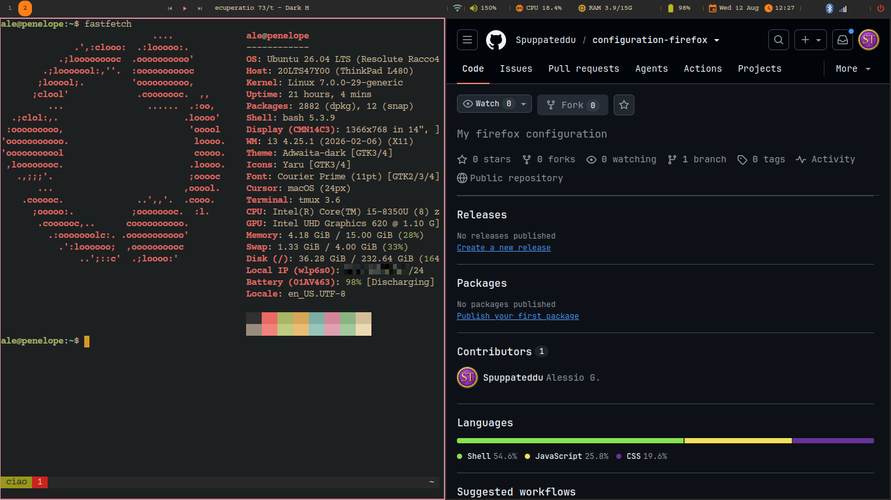

# .i3rc

My i3 window manager setup: Gruvbox Dark palette, eww top bar (music + volume
controls, per-monitor workspaces, calendar popup, system tray), rofi launcher,
solid Gruvbox-dark background, picom compositing, dunst notifications, and
mpd + ncmpcpp for offline music.

**Windows float by default** — i3 runs here as a normal desktop, not a tiling
WM. See [Floating desktop](#floating-desktop) below.



- **Install on a new machine:** run `./setup.sh` (idempotent — also builds eww from source; the font — Courier Prime, the only one this repo names — and the cursor theme come from *best-linux-environment*). Full breakdown in [INSTALL.md](./INSTALL.md).
- **Main i3 config:** [config](./config)
- **Top bar:** [eww/](./eww/) — `eww.yuck` (layout/widgets), `eww.scss` (style), `scripts/` (data sources)
- **Launcher themes:** [rofi/](./rofi/)
- **Compositor:** [picom/picom.conf](./picom/picom.conf)
- **Notifications:** [dunst/dunstrc](./dunst/dunstrc)
- **Music daemon:** [mpd/mpd.conf](./mpd/mpd.conf) + [ncmpcpp/config](./ncmpcpp/config)
- **Scripts:** [scripts/](./scripts/) — bar launcher, power menu, music helpers

> Bluetooth is the blueman tray icon in the bar's systray.
> [`scripts/bluetooth_menu.sh`](./scripts/bluetooth_menu.sh) is a rofi
> alternative to it, kept but **not bound to anything** — add a `bindsym` in
> `config.local` if you want it.

## On its own, or as part of best-linux-environment

Both work, and this repo is written not to care which one ran it.

**On its own** — clone it **to `~/.i3rc`** and run [`setup.sh`](./setup.sh).
The path is not a convention here: i3's config format has no way to refer to its
own directory, so the 17 `exec` lines in [config](./config) name `~/.i3rc`
literally, and `setup.sh` refuses to run from anywhere else rather than
half-working at runtime. Two things are deliberately *not* in this repo because
they are shared with the terminal and the editor — the **font** (Courier Prime)
and the **cursor theme**; install those by hand from
[INSTALL.md §3](./INSTALL.md) when you go standalone.

**As part of a whole machine** —
[**best-linux-environment**](https://github.com/Spuppateddu/best-linux-environment)
sets up an entire Ubuntu box, and this is one of the config repos it manages.
Its `./setup.sh` clones this one into `~/linux-configuration/i3`, leaves
`~/.i3rc` behind as a symlink to it — which is what satisfies the path check
above — and then calls [`install.sh`](./install.sh), the thin wrapper that runs
`setup.sh` and live-reloads i3 and the eww bar afterwards. It also owns the
font and the cursor theme, and installs the programs the keybinds assume
(alacritty, firefox, flameshot), so there is nothing left to do by hand.

## Floating desktop

Every window opens **floating**, with a real draggable title bar, at half the
screen width × 70% of its height, centred. Click-to-focus, not focus-follows-mouse.

`$mod+Shift+h/j/k/l` is **layout-aware** — i3 cannot be, so
[`scripts/float.sh`](./scripts/float.sh) decides per keypress:

| | floating window | tiled window |
|---|---|---|
| `$mod+Shift+h` / `l` | snap to the left / right half | move it left / right |
| `$mod+Shift+k` | maximise (fills the workspace) | move it up |
| `$mod+Shift+j` | back to the standard size, centred | move it down |

The arrow keys (`$mod+Shift+←↓↑→`) never snap: on a floating window they nudge
it a few pixels. `$mod+Shift+space` tiles the focused window, and `Super+Down`
stashes it in the scratchpad — the closest thing i3 has to a minimise.

Nothing is hardcoded to one screen. Every number comes from the live workspace
rect, which i3 has already shrunk by the eww bar's strut, so the same commit is
exact on a 3440×1440 ultrawide and a 1366 ThinkPad panel. `float.sh watch` runs
as an `exec_always` daemon and places each new window from the `window::new`
event; the `move position center` in `config` is only its fallback.

Two knobs, both optional, exported before i3 starts:

```bash
I3RC_STD_W_PCT=50   # standard window width, % of the usable workspace
I3RC_STD_H_PCT=70   # ...and its height
```

**To get plain tiling i3 back**, delete the `for_window [class=".*"] floating
enable…` line and the `float.sh watch` line from [config](./config). The
`$mod+Shift+h/j/k/l` bindings keep working: with nothing floating, `float.sh`
always takes the `move` branch.

## Machine-specific settings

Anything that should apply to **only one computer** (and never be committed or
shared with people who clone this repo) goes in:

```
~/.i3rc/config.local
```

The main [config](./config) ends with `include ~/.i3rc/*.local`, so this file is
loaded **last** — meaning it can override anything in the shared config. Any
`*.local` file is git-ignored, and the wildcard is a harmless no-op on machines
that don't have one, so the repo stays clean and portable.

Use plain i3 config syntax. Typical uses: per-monitor layout, extra keybinds, or
display scaling. For example, to make everything on a low-res laptop panel
smaller:

```
# ~/.i3rc/config.local
exec_always --no-startup-id xrandr --output eDP-1 --scale 1.25x1.25
```

`xrandr --scale` renders the desktop at a larger virtual size and shrinks it onto
the panel — higher number = smaller UI. Reset with `--scale 1x1`. Reload i3 after
editing with `$mod+Shift+c`.

### The bar is *not* machine-specific — don't tune it per computer

The bar sizes itself from the output's width, so the same commit has to look
right on a 1366 ThinkPad panel and a 4K monitor at once. Hand-tuning it on one
machine is what breaks the other. Two rules keep that from happening:

- **Anything inside a single element is a constant, in `eww.scss`.** The gap
  between an icon and its own value is `.val { margin-left }` — one number, the
  same on every screen. It is deliberately *not* a density-tier variable; when
  it was, the identical pair rendered tight on a wide output and roomy on a
  narrow one, and correcting either one moved the other.
- **Only the gaps *between* segments react to width**, via the three density
  tiers in [`eww/scripts/screen.sh`](./eww/scripts/screen.sh) (`wide` ≥1800px,
  `compact` ≥1500px, `dense` below). Those set `gap`/`group` and the paddings in
  `eww.scss`'s `.bar.compact` / `.bar.dense` blocks.

The music title slot is a fixed width per tier — `tw` in `screen.sh`, in
characters. It is a target, not a leftover: raise it for a longer title panel,
lower it for a shorter one, and the spare width goes to the spacers on either
side. Leftover width only ever caps it, so a genuinely narrow screen still fits.

To check a change against another size without owning the hardware, plug a width
into `screen.sh`'s tier table, or just `xrandr --output <o> --mode <smaller>`.

## Quick layout

```
~/.i3rc/
├── config                     # i3 main config (included from ~/.config/i3/config)
├── config.local               # per-machine overrides (git-ignored, optional)
├── setup.sh                   # the installer (idempotent, --dry-run)
├── install.sh                 # thin wrapper for orchestrators → setup.sh + live reload
├── INSTALL.md                 # package list + step-by-step setup
├── eww/
│   ├── eww.yuck               # bar layout: workspaces, music, status, calendar
│   ├── eww.scss               # Gruvbox Dark styling
│   └── scripts/               # JSON emitters: workspaces, player, network,
│                              #   volume, screen (layout tier + the bar's output)
├── gtk/{gtk.css,settings.ini} # GTK menu theming (nm-applet, blueman tray menus)
├── rofi/{config,launcher,powermenu}.rasi
├── picom/picom.conf
├── dunst/dunstrc
├── mpd/mpd.conf
├── ncmpcpp/config
└── scripts/
    ├── launch_eww.sh          # runs the bar on the primary monitor
    ├── toggle_eww.sh          # show/hide the bar ($mod+Shift+b)
    ├── eww_lib.sh             # shared: output detection + bar open (sourced)
    ├── emit_lib.sh            # shared: JSON escape + resubscribe loop (sourced)
    ├── powermenu.sh           # rofi lock/suspend/reboot/shutdown
    ├── bluetooth_menu.sh      # rofi adapter toggle + device connect (unbound)
    ├── player_ctl.sh          # MPRIS music control (mpd priority)
    ├── player_lib.sh          # shared: active-player selection (sourced)
    ├── play_folder.sh         # rofi-picked folder → mpd shuffle play
    ├── net_lib.sh             # shared: interface pick + wifi SSID (sourced)
    ├── runtime_lib.sh         # shared: where lock/pid/state files live (sourced)
    ├── theme.sh               # alacritty dark/light toggle ($mod+Shift+t)
    ├── theme_lib.sh           # shared: find alacritty's config (sourced)
    ├── float.sh               # floating desktop: places new windows, snap keys
    ├── set_background.sh      # solid Gruvbox-dark root window (feh, picom-safe)
    ├── resize_border.sh       # red focused border while in resize mode
    ├── restart_kbd.sh         # key repeat + Caps→Ctrl, re-applied on hotplug
    └── restart_xbanish.sh     # hide pointer while typing, show on mouse move
```

See [INSTALL.md](./INSTALL.md) for the full keybinding cheat sheet.
